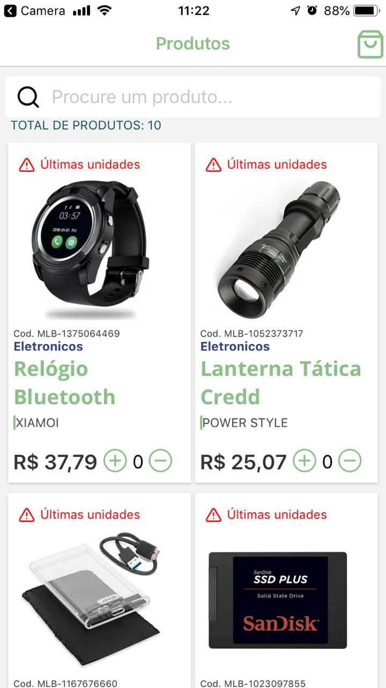
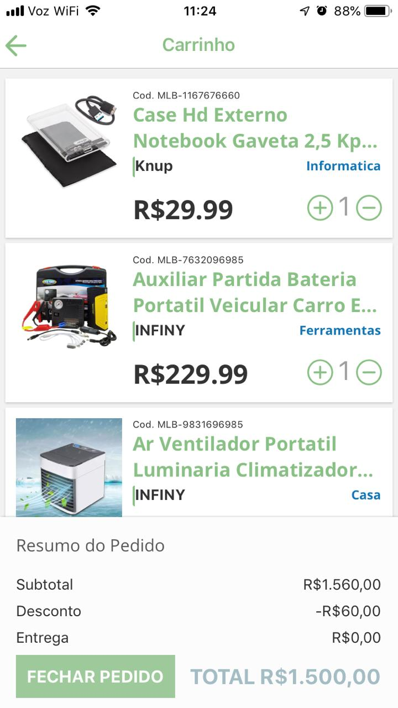

<h1 align="center">
    Nexfar Challenger
</h1>

<h4 align="center">
  Consiste em uma aplicação ecommerce para listagem de produtos e do carrinho de compras.
    - Navegar entre as páginas de produtos e carrinho
    - Listar produtos
    - Adicionar/Remover/Alterar quantidade produtos ao carrinho
    - Toda vez que alguma dessas ações for tomada, deve ser enviada uma mensagem ao usuário informando do sucesso ou erro.
    -Calcular o total do carrinho
    - Ao final da implementação, a sua interface deve seguir a estrutura dos wireframes abaixo. Um dos pontos mais importantes que iremos
    considerar, além do funcionamento, é o acabamento visual.

</h4>

  

  

  

 

  

##  MOBILE

- [React Native](https://facebook.github.io/react-native/)
- [Expo](https://expo.io/)
- [React Navigation v4](https://reactnavigation.org/)
- [Axios](https://github.com/axios/axios) Promise based HTTP client
- [Eslint]()
- [Prettier]()
- [Redux]()
- [Saga]()

##  TO DO TASKS

- [X] CONFIGURAÇÃO INICIAL, ESLINT, PRETTIER
- [X] TELA/LAYOUT DE PRODUTOS COM MOCK
- [X] LISTAR PRODUTOS DA API
- [X] TELA/LAYOUT DE CARRINHO COM MOCK
- [X] LISTAR PRODUTOS DO CARRINHO DA API
- [X] TRANSFERIR REGRA DE NEGOCIO PARA REDUX/SAGA
- [] FINALIZAR AJUSTES EM REGRA DE NEGÓCIO.
- [] Finalizar SearchBar.

## Instalação
- Você deve ter instalado: Node JS, Expo, React Native, Emulator .
- Realize o clone ou download do repositorio.
- Entre na pasta do repositório.
- npm install ou yarn para baixar as dependencias.
- yarn start para iniciar o projeto.
- Com o celular você deve ler o QR Code para iniciar o projeto do emulador.
- Caso rode o projeto no emulador, selecione a opcão Run on Android/IOS simulator,

